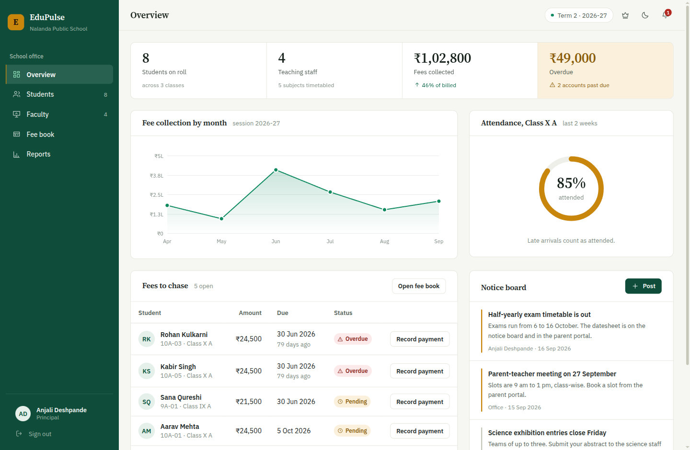
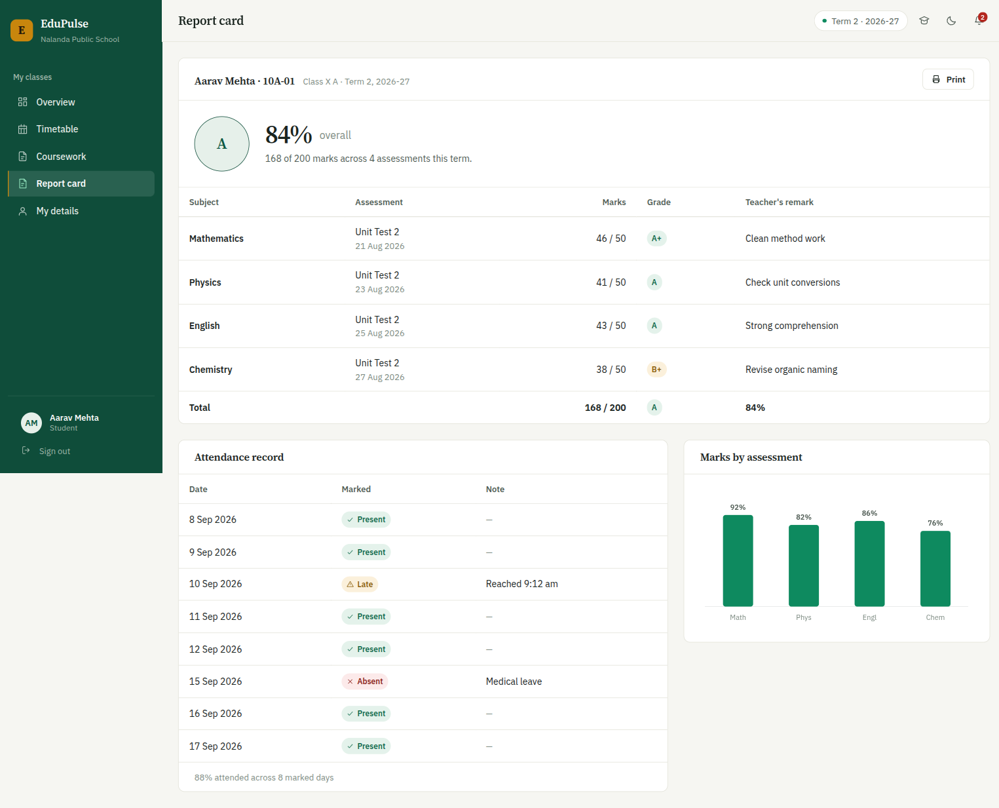
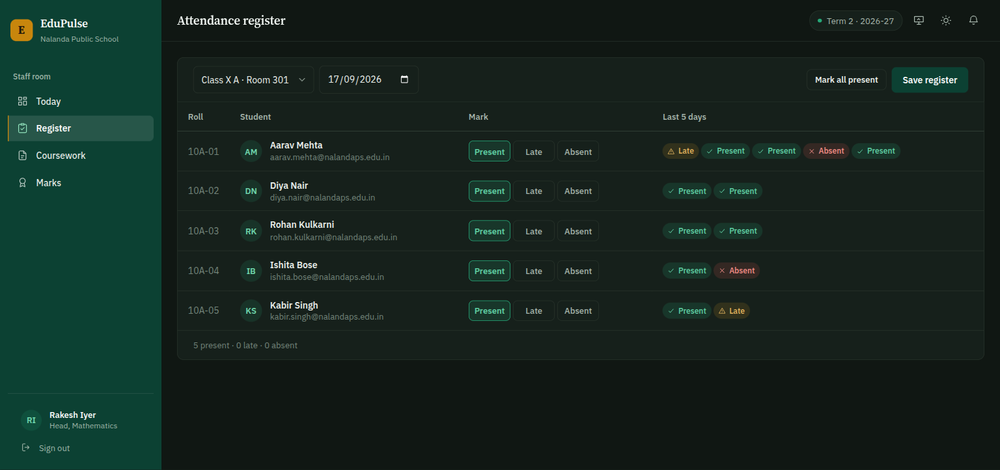
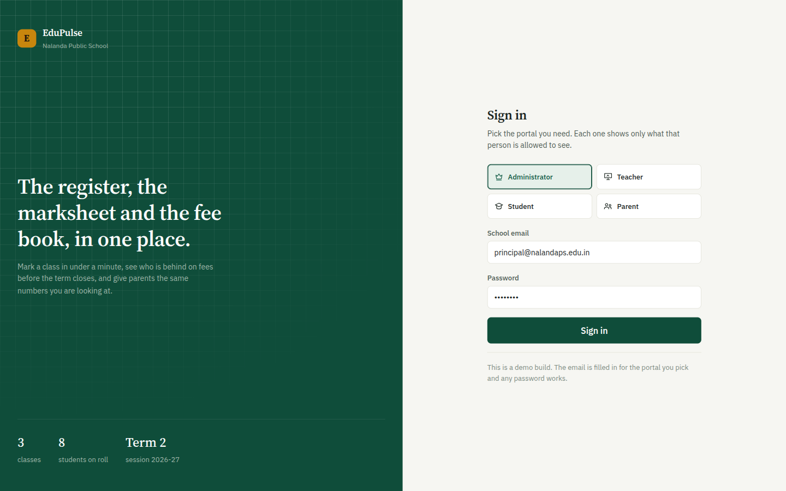
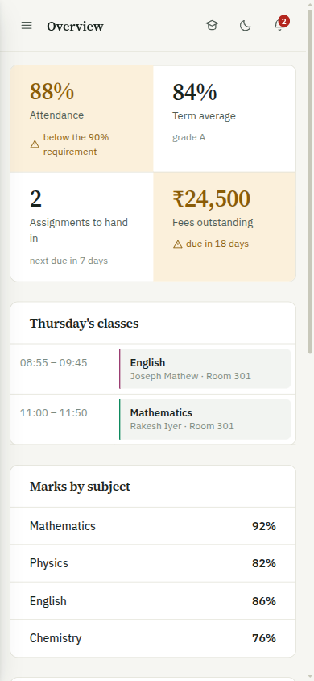

# EduPulse

School administration for a single school: the attendance register, the
marksheet, the fee book and the notice board, with a separate view for the
office, teachers, students and parents.

Express + MongoDB on the back, vanilla JavaScript on the front. No build step,
no framework, no bundler — clone it and run it.



| | |
|---|---|
|  |  |
|  |  |

## Run it

MongoDB has to be reachable. If you don't have it installed:

```bash
docker run -d --name edupulse-mongo -p 27017:27017 mongo:7
```

Then:

```bash
npm install
cp .env.example .env     # edit PORT or MONGO_URI if you need to
npm run seed             # loads one school's worth of data
npm start
```

Open <http://localhost:5055>. Pick a portal on the sign-in screen — the email
fills itself in and any password works.

| Portal | Signs in as | Can do |
|---|---|---|
| Administrator | Anjali Deshpande, Principal | Roll, faculty, fee book, reports, notices |
| Teacher | Rakesh Iyer, Head of Mathematics | Mark the register, set coursework, enter marks |
| Student | Aarav Mehta, Class X A | Timetable, coursework, report card, fee statement |
| Parent | Sunita Mehta | One child's attendance, marks, fees |

The topbar has a portal switcher so you can move between the four without
signing out.

**The app runs without MongoDB.** If the database is down the UI still works
against its own browser-local copy of the data, and the chip in the topbar
turns amber to tell you. That is what makes it demo-able anywhere.

## Layout

```
├── src/                      Express API
│   ├── server.js             bootstrap: connect, then listen
│   ├── app.js                the Express app — middleware, routes, static
│   ├── seed.js               npm run seed
│   ├── config/               env + database connection
│   ├── models/               13 Mongoose schemas
│   ├── controllers/          request handlers
│   ├── routes/               endpoints, mounted by routes/index.js
│   └── middleware/           JWT guard, error handler
├── public/                   everything the browser gets
│   ├── index.html            the shell: sign-in screen + app chrome
│   └── assets/
│       ├── css/              tokens → base → layout → components → views
│       └── js/
│           ├── app.js        boot and shell wiring
│           ├── core/         icons, format, store, api, data, auth, ui,
│           │                 charts, router
│           └── views/        admin, teacher, student, parent
└── docs/screenshots/
```

The stylesheets load in dependency order, and each one has a job: `tokens.css`
holds every colour, size and font as a custom property; `base.css` is the reset
and type; `layout.css` is the shell; `components.css` is the reusable parts;
`views.css` is what only one screen needs.

## API

```
GET    /api/health              service + database status
POST   /api/auth/login          returns a JWT
GET    /api/auth/me             the signed-in user

GET    /api/students            ?search= &classId= &page= &limit=
POST   /api/students
DELETE /api/students/:id

GET    /api/teachers            POST /api/teachers
GET    /api/classes             POST /api/classes
GET    /api/attendance          POST /api/attendance/batch
GET    /api/assignments         POST /api/assignments  POST /api/assignments/submit
GET    /api/fees                POST /api/fees/:id/pay
GET    /api/notices             POST /api/notices
```

Every response has the same shape:

```json
{ "status": 200, "success": true, "data": {} }
```

Try it:

```bash
curl -s localhost:5055/api/health
curl -s "localhost:5055/api/students?search=aarav" | head -c 300
```

## How the two halves connect

Worth knowing before you read the code, because it is the one thing that is
not obvious:

- **Reads** come from the browser-local store (`public/assets/js/core/store.js`),
  which holds one complete, internally consistent dataset.
- **Writes** go through `core/data.js`, which applies the rules that belong to
  a write — what a new roll number looks like, what re-marking a register does
  to the rows already there — and updates that store.
- The REST API is real, seeded and serves the full surface above. The UI checks
  whether it is up and reports that in the topbar, but does not write through
  to it.

The reason is an id-space mismatch: the store keys rows `stu-1` and `cls-10a`,
while Mongo issues ObjectIds. Posting a student with `classId: "cls-10a"` fails
Mongoose's cast before it reaches the collection, so a write-through would look
like it worked and quietly change nothing.

**To make live writes real**, give the models string `_id`s and seed them to the
same keys the store uses. Then the two id spaces are one and `core/data.js` can
post first and fall back second. That is the next change worth making here.

## Design

The palette is school stationery rather than dashboard convention: exam-paper
off-white surfaces, green-cast ink, a chalkboard green that owns the sidebar in
both themes, and brass reserved for the things that need attention — an overdue
fee, an unmarked register, attendance under the 90% requirement. Nothing else
is allowed to use brass, so when you see it, it means something.

Type is Source Serif 4 for headings and figures, IBM Plex Sans for the
interface, with tabular figures everywhere a number sits under another number.

Tables are ruled like a register — horizontal hairlines, no vertical lines, no
zebra stripes — because the eye tracks along a row, not into a grid of boxes.
Statistics sit in one divided strip rather than four floating cards.

Chart colours are checked, not guessed. A single measure across several labels
is one colour; grades run down a single-hue ramp; status colours are reserved
and always ship with an icon and a word, never colour alone. The four
categorical hues pass CVD separation and surface contrast in both light and
dark:

| Slot | Light | Dark |
|---|---|---|
| 1 | `#0e8a5f` | `#25a878` |
| 2 | `#c8860d` | `#be8a1c` |
| 3 | `#1e72c8` | `#4e93e0` |
| 4 | `#9b3e72` | `#c96a9e` |

Dark mode is its own set of steps against a dark surface, not an inverted light
theme. Keyboard focus is always visible, `prefers-reduced-motion` is respected,
and the layout works down to 360px.

## Notes

- Sign-in is a demo gate: it accepts any password for a known address. The JWT
  middleware falls back to a demo admin in development and returns 401 in
  production (`NODE_ENV=production`).
- File upload is not implemented. Adding study material or handing in an
  assignment records the entry without storing a file, and the UI says so.
- `npm run seed` clears all 13 collections first, so it is safe to re-run.

## Credit

Forked from [prince1657/Student-Management-System](https://github.com/prince1657/Student-Management-System)
and reworked: reorganised into `src/` and `public/`, new interface and design
system, charts rebuilt, sign-in and sessions added, and the data localised to
one Indian school.

The upstream project ships no licence, so none is claimed here. Terms are the
original author's to set.
